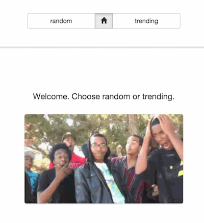

# Welkin Coding Challenge

Welcome to the Welkin Health Angular Coding Challenge. It's pretty simple and the structure is loose,
but here's the deal. Using the giphy api (for kicks), create a simple single-page angular app
that exhibits some of the qualities of the reference implementation here:

Feel free to implement the reference app or create something of similar complexity. Some features to include:

1. List and detail views.
1. Navigation and routing. Preferably without needless page refreshes.
1. Url addressability. Note how refreshing in the reference application produces the same gif.

Other things to keep in mind:

1. Code sanity. The seed project offers a reasonable organization for a small application.
1. Use angular features. Things like directives and services may be applicable and efficient in your application. Use them if relevant.
1. Painless setup. Your application should be launched with `npm start` with no other setup required.

# Getting started

To launch this seed application:

1. Clone this repo. Navigate to the local checkout.
2. Ensure that you have node installed. Run `node --version`. In the case that node is not installed, you can download from [here](http://nodejs.org/download/) or, if using a mac, you can run `brew install node`.
3. Run `npm start`.

The giphy api docs can be found [here](https://github.com/giphy/GiphyAPI).

For a good angular reference, see the phonecat tutorial [here](https://docs.angularjs.org/tutorial).

Happy coding.
